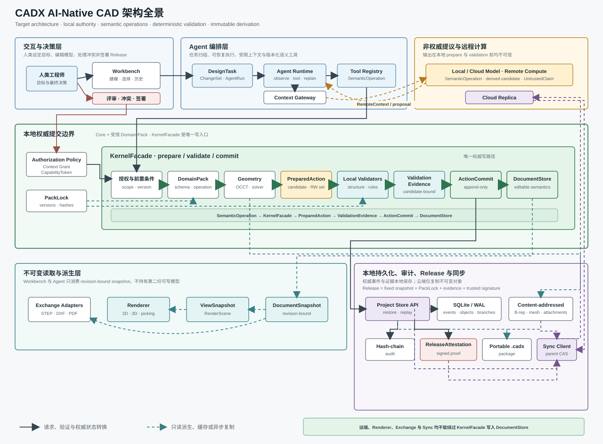

# CADX AI-Native CAD 目标设计

> 文档类型：目标架构
> 状态：Accepted
> 适用范围：Target
> 权威内容：目标产品与目标架构；不代表仓库已经实现这些能力
> 返回：[文档索引](index.md) · [ADR 索引](adr/README.md)

## 1. 产品定义

CADX 的目标是一个本地优先、可扩展的通用 CAD 平台。AI 不是附加在命令面板上的助手，而是受权限约束的设计执行者：它观察工程、调用语义工具、提交可编辑的设计动作，并用可核验的证据解释结果。人类工程师保留目标设定、风险接受、发布签署和最终决策权。

长期产品目标是完整的设计创作型 MCAD，而不只是查看器、格式转换器或自然语言生成演示。交付顺序固定为：

1. 以参数化机械建模完成第一个深度纵切，打通草图、特征、装配、制图、验证和交换链路。
2. 扩展到曲面、钣金、焊件、配置族、高级装配、运动、工程图和 MBD/PMI，逐步覆盖完整 MCAD 创作流程。
3. 在通用核心和 Pack 契约稳定后，以 EDA 等新的 `DomainPack` 验证跨领域能力。

CAM、CAE、PLM/PDM 不是第一阶段内建创作模块；它们通过交换格式、发布产物和后续集成进入平台。架构不会为了未来领域牺牲机械纵切的深度。

## 2. 不可破坏的设计原则

1. **本地内核拥有最终提交权。** Agent、远程模型和云端计算只能提出候选操作、派生候选或 `UntrustedClaim`，不能直接改变权威工程状态。
2. **AI 输出语义，不输出存储。** AI 可以指定尺寸、参考系和受约束的几何种子，但不能写最终 B-rep、显示网格、数据库记录或内部补丁。
3. **每个 action 独立落地。** action 验证通过后立即提交；一句 Prompt 产生的 action 由 `PromptChangeSet` 归组，但不构成跨 action 的全有或全无事务。
4. **验证与生成分权。** Planner 的自述结论都是 `UntrustedClaim`；只有本地确定性 validator 能生成提交所需的 `ValidationEvidence`。
5. **可编辑语义是权威状态。** 参数、约束、特征和关系图是源数据；B-rep、网格、缩略图和索引都是可重建派生物。
6. **版本锁定义可重放边界。** 同一版本锁内追求确定重放；跨版本只承诺经迁移验证的语义等价，不承诺字节或浮点结果完全一致。
7. **审计历史只追加。** 回滚通过新的补偿提交实现，已经发生的人工或 Agent 操作不会从历史中删除。
8. **扩展性不等于隔离。** 原生动态 `DomainPack` 在宿主进程内运行，属于受信任代码；任意 Pack 加载场景不具备安全沙箱保证。

## 3. 总体架构

### 3.1 架构全景

下图描述 Target 架构，不代表所有组件已经实现。它同时展示控制流、权威数据流、派生数据流和端云信任边界：

[](assets/architecture-panorama.svg)

读图时必须保持以下约束：

1. 实线表示请求、验证或权威状态转换；虚线表示可重建缓存或异步复制。
2. `KernelFacade -> ActionCommit -> DocumentStore` 是唯一写路径。模型、远程计算、Renderer、Exchange adapter 和 Sync Service 都不能直接写权威状态。
3. Agent 与 Workbench 只能读取绑定 revision 的 snapshot；渲染、B-rep、网格和索引都是派生物。
4. 云端只接收授权上下文或复制不可变对象，返回值在本地 prepare 和 validation 之前都不可信。
5. Release 绑定固定 snapshot、`PackLock` 和 evidence，由人类或受信设备签署，不等同于普通 action commit。

### 3.2 目标数据流

```text
User intent
  -> DesignTask scope
  -> PromptChangeSet
  -> AgentRun
  -> Agent observe/query/tool loop
  -> SemanticOperation
  -> KernelFacade authorization + preconditions
  -> DomainPack / geometry kernel prepare
  -> PreparedAction
  -> local validators
  -> ValidationEvidence
  -> KernelFacade ActionCommit
  -> DocumentSnapshot / ViewSnapshot
```

远程能力位于提议和辅助计算一侧，不位于提交链路中：

```text
Project-scoped context grant
  -> approved context query
  -> local/cloud model or remote compute
  -> SemanticOperation | UntrustedClaim | derived candidate
  -> local KernelFacade
```

### 3.3 组件职责

| 组件 | 目标职责 | 明确禁止 |
| --- | --- | --- |
| Workbench | 呈现视图、选择、评审、历史、冲突与发布状态 | 持有另一份可写模型 |
| Agent Runtime | 管理 observe/tool/replan 循环、上下文、权限和任务生命周期 | 获取可写文档引用 |
| Semantic Tool Registry | 暴露版本化、可审计的领域操作 | 暴露任意内部命令反序列化入口 |
| `KernelFacade` | 唯一写入口；准备、求解、验证和提交 action | 绕过 validator 或 Pack lock |
| Core Model | 保存稳定身份、版本、关系、参数、约束和依赖 | 保存未约束的安全关键 JSON 属性 |
| `DomainPack` | 定义领域 schema、语义操作、规则、再生和交换适配 | 绕过 Core 提交协议 |
| Geometry Adapter | 执行 B-rep、求交、拓扑映射和派生网格 | 成为用户意图或历史的唯一表示 |
| Project Store | 保存事件、快照、Pack lock、证据和内容寻址对象 | 把展示缓存当作权威历史 |
| Sync Service | 复制不可变提交和 blob、管理分支头 | 替代本地提交或静默合并分支 |

表现层只消费不可变的 `ViewSnapshot`。`DocumentStore` 保持私有，外部组件通过只读 `DocumentSnapshot` 观察，通过 `KernelFacade` 请求改变。

### 3.4 关键目标接口

下列名称是目标契约，不表示当前 crate 已经提供同名 Rust API：

| 接口/类型 | 职责 |
| --- | --- |
| `DocumentStore` | 私有权威状态和本地提交序列化器，不从 Core 外部暴露可写引用 |
| `DocumentSnapshot` | 绑定 revision 与 Pack lock 的不可变模型视图 |
| `KernelFacade` | capability 检查、prepare、candidate 验证和 action commit 的唯一入口 |
| `DesignTask` | 跨多次 Prompt 持续存在的用户目标、作用域和审计归属 |
| `AgentRun` | 一个 `PromptChangeSet` 下可暂停、恢复和重试的执行实例 |
| `SemanticOperation` | Agent 或人工工具提交的版本化领域意图 |
| `PreparedAction` | 本地 prepare 产生的短期 candidate，绑定 base revision、读写集和 candidate hash，不能从远程直接反序列化为提交 |
| `ActionCommit` | 单个有效 action 的不可变提交，包含父 revision、operation、diff、evidence 和来源 |
| `PromptChangeSet` | 将一个 Prompt 的多次 `ActionCommit` 归组，并保存进度、失败和补偿关系 |
| `CapabilityToken` | 绑定 Task 与 ChangeSet，并限定 Pack、操作类别、对象范围和有效期的写权限 |
| `RemoteContext` | 实际发给 provider 的不可变、已授权上下文，绑定 source revision、数据类别和 payload hash |
| `ValidationEvidence` | 本地 validator 对精确 candidate 生成的可机器核验证据 |
| `ReleaseAttestation` | 对固定 revision、版本锁、发布策略和 evidence 集合的签名证明 |

## 4. 权威数据模型

### 4.1 通用核心

核心只保存跨领域稳定的概念：

- 全局稳定的对象、提交、分支、任务和 ChangeSet 标识，采用 UUID/ULID 等不依赖进程顺序的 ID。
- 每个对象的单调 `ObjectVersion`，用于细粒度乐观并发前置条件。
- 带角色的关系、参数、约束、依赖边和来源信息。
- 带量纲的 `Quantity`。关键几何值使用规范化整数数据库单位，显示单位不能改变保存语义。
- 版本化 typed payload envelope，用于承载 Pack 定义的数据。

目标接口的概念形态如下；字段名用于固定职责，不表示现有 Rust API：

```rust
pub struct ObjectId(pub Uuid);
pub struct ObjectVersion(pub u64);

pub struct Quantity {
    pub value_in_database_units: i128,
    pub dimension: Dimension,
}

pub struct TypedPayload {
    pub schema_id: String,
    pub schema_version: u32,
    pub protobuf: Vec<u8>,
}

pub struct DocumentSnapshot {
    pub revision: RevisionId,
    pub pack_lock: PackLock,
    // Immutable views of objects, relations, parameters and constraints.
}
```

核心不得用无约束的 `Map<String, Value>` 承载会影响几何、制造或安全判断的数据。Pack schema 负责解码和验证 typed payload；核心仍负责身份、引用完整性、量纲、版本和提交不变量。

### 4.2 参数化机械模型

Mechanical Pack 的权威模型是参数化 Feature Graph：草图、约束、基准、特征、装配引用和制图引用形成显式依赖图。Open CASCADE Technology（OCCT）作为首个机械几何适配器，负责生成和验证 B-rep；B-rep 按输入与版本锁的内容哈希缓存，删除缓存后必须能够再生。

面和边不能通过瞬时数组下标长期引用。稳定拓扑引用至少包含生产特征、语义角色和几何签名；每次 regeneration 都生成映射结果：

```text
Resolved(old_ref -> new_ref)
Ambiguous(old_ref -> candidates)
Missing(old_ref)
```

只有 `Resolved` 可以自动更新下游引用。`Ambiguous` 和 `Missing` 必须形成稳定诊断并阻止依赖 action 提交，禁止静默重绑定到“最接近”的面或边。

首个机械纵切应覆盖：

- 2D 草图与尺寸/几何约束；
- 拉伸、旋转、切除、孔、圆角、倒角、阵列和镜像；
- 基础零件、装配配合和工程图；
- STEP、DXF 和 PDF 交换边界；
- 参数修改、特征再生、稳定拓扑引用和制造前验证的闭环。

## 5. Domain Pack 契约

`DomainPack` 是版本化的原生动态插件。宿主与 Pack 使用稳定 C ABI vtable 作为调用边界，使用 protobuf 消息交换结构化数据，避免把 Rust ABI 或 C++ 对象布局暴露为兼容承诺。

每个 Pack 必须提供 manifest：

```text
pack id + semantic version
ABI version + schema versions
operation and query descriptors
validator and migration descriptors
native artifact hash + publisher/trust metadata
```

工程保存 `PackLock`，固定所有会影响语义重放、几何再生和验证结果的依赖：Core，Pack manifest 与 artifact，ABI 与 schema，几何内核，求解器，validator，规则集，材料库，单位数据库，交换 profile 和发布策略的版本或内容 hash。打开工程时：

- 完全匹配时按锁定版本重放；
- 存在显式迁移器时，在隔离 candidate 上迁移、重验并生成迁移提交；
- 无兼容 Pack 或迁移器时，以只读/诊断模式打开，不猜测转换。

Pack 可以扩展类型、操作、查询、验证、再生和交换，但不能直接写 `DocumentStore`。Pack 返回候选变更和诊断，由 `KernelFacade` 检查后提交。

原生 Pack 与宿主同进程、同权限。manifest、签名或 hash 能说明来源和复现条件，不能阻止恶意 Pack 读取内存、访问文件或令进程崩溃。需要不受信任第三方扩展时，必须另行设计进程隔离协议；该能力不属于本目标契约。

## 6. Agent 与语义工具

### 6.1 操作边界

Agent 只调用注册的 `SemanticOperation`。操作应表达设计目的，例如“以草图轮廓创建拉伸特征”“设置孔系列参数”“建立同轴配合”，而不是“写入实体 map”或“提交一组任意坐标”。

```rust
pub struct SemanticOperation {
    pub operation_id: OperationId,
    pub change_set_id: PromptChangeSetId,
    pub pack_id: PackId,
    pub schema_version: u32,
    pub capability: CapabilityId,
    pub preconditions: Vec<ObjectPrecondition>,
    pub payload: TypedPayload,
    pub idempotency_key: IdempotencyKey,
}
```

AI 可以提供设计尺寸、方向、参考系、候选约束和受约束的几何种子。Pack 必须把它们解释成可编辑的领域对象，并由本地求解器决定最终几何。以下内容永不作为 Agent 可写接口：最终 B-rep、三角网格、内部对象表、历史记录、`ValidationEvidence` 和 Release 签名。

### 6.2 上下文与授权

完整工程上下文通过查询能力可达，但不会在每轮模型请求中上传完整快照。Agent 先获得工程摘要、选择集和任务状态，再按需调用有界查询：对象、关系、参数、约束、依赖、局部几何摘要、诊断、历史和允许的源文件片段。

外部 provider 的授权以项目为作用域，可以持续到用户撤销，但必须绑定：

- provider 与 endpoint allowlist；
- 允许的数据类别、查询能力和最大 payload；
- 可执行的语义工具和对象范围；
- 有效期、撤销状态和项目身份。

项目级持续授权不是无条件上传许可。每次实际发送仍记录 provider、数据类别、对象范围、字节数和 payload hash；凭据、未授权附件和其他项目数据不得进入上下文。写操作还需要绑定当前 `DesignTask` 与 `PromptChangeSet` 的 `CapabilityToken`，其范围必须覆盖 Pack、操作类别和对象范围。

### 6.3 observe/tool/replan 循环

```text
observe latest DocumentSnapshot
  -> query approved context
  -> propose SemanticOperation
  -> check capability + object-version preconditions
  -> DomainPack prepares PreparedAction
  -> run local validators and generate ValidationEvidence
  -> commit one action
  -> observe the new revision
```

本地提交协调器在 action 边界串行化写入，不同 `PromptChangeSet` 的 action 可以交错执行。每个操作携带它读取或修改对象的版本前置条件；若对象已变化，Agent 必须观察新 revision 并重新规划。自动修复/重规划最多三次，之后该 action 失败并生成诊断，已经成功的 action 保留，系统不得静默覆盖较新的人工或 Agent 修改。

相同 `idempotency_key` 的重试只能得到原提交结果或明确冲突，不得产生重复几何。`AgentRun` 可以暂停、恢复或在崩溃后从最后一个已提交 action 继续。

## 7. PromptChangeSet 与历史

目标运行层级固定为：

```text
DesignTask（长期目标）
  -> PromptChangeSet（每次用户 Prompt）
    -> AgentRun（一次可暂停、恢复或重试的执行）
      -> ActionCommit*
```

后续 Prompt 在同一 `DesignTask` 下创建新的 `PromptChangeSet`。ChangeSet 负责把多个实时提交的 action 归因到同一意图，至少记录原始 Prompt、结构化目标、运行身份、授权、AgentRun、action 顺序、提交 ID、失败诊断和最终状态。一个 ChangeSet 可以因显式重试包含多个 AgentRun；恢复已有 checkpoint 不创建重复 action。

```text
Running
  -> Completed
  -> PartiallyFailed
  -> Cancelled

Completed | PartiallyFailed | Cancelled
  -> RevertRequested
  -> Reverted | RevertedWithConflicts
```

状态描述 ChangeSet 结果，不改变 action 已经提交的事实。单个 action 是原子的；ChangeSet 允许部分成功，因而用户可以立即看到、检查和继续编辑长任务的中间结果。

人工操作和其他 `PromptChangeSet` 的 action 使用同一提交时间线，并有独立来源标识。回滚某个 Prompt 时，内核创建一个关联原 ChangeSet 的补偿 ChangeSet：

1. 根据原提交的前后对象版本计算期望恢复内容。
2. 未被后续提交改变的对象生成补偿操作并恢复。
3. 已被后续人工或 Agent 修改的对象不自动覆盖，而是进入冲突报告。
4. 无冲突补偿仍可提交，结果标记为 `RevertedWithConflicts`。

回滚永远不会移动或删除历史头。事件日志和快照是权威恢复来源；预计算 reverse patch 只能作为经过 hash 校验的性能缓存。

## 8. 验证、Draft 与 Release

### 8.1 Action 提交闸门

Planner、远程求解器或 Pack 可以返回建议和 `UntrustedClaim`，但不能自行声明通过。`KernelFacade` 对精确 candidate revision 调用锁定版本的本地 validator，并生成：

```rust
pub struct ValidationEvidence {
    pub candidate_revision: RevisionId,
    pub input_state_hash: ContentHash,
    pub validator: ValidatorId,
    pub core_version: Version,
    pub pack_lock_hash: ContentHash,
    pub diagnostics: Vec<Diagnostic>,
    pub measurements: Vec<MeasuredValue>,
    pub outcome: ValidationOutcome,
}
```

结构损坏、悬空引用、量纲错误、约束不收敛、无效 B-rep、过期前置条件和违反不可豁免规则属于 hard error，阻止该 action 提交。warning 和 info 可以随 Draft 提交，但必须绑定对象并持续可见。

`ValidationEvidence` 绑定 candidate revision 和输入 hash。对其他 revision 生成的证据、版本不匹配的缓存或 Planner 自报结果都不能复用为提交依据。

### 8.2 Draft 与 Release

Draft 是持续编辑状态，允许带 warning 的有效提交。Release 是独立 sign-off，不等同于“最后一个 action 成功”：

1. 固定待发布 revision 和完整 `PackLock`。
2. 执行发布策略要求的全量再生、验证和交换检查。
3. 收集材料、规则、validator 和测量证据。
4. 由用户或受信设备签署 `ReleaseAttestation`。

```rust
pub struct ReleaseAttestation {
    pub project_id: ProjectId,
    pub revision: RevisionId,
    pub state_hash: ContentHash,
    pub pack_lock_hash: ContentHash,
    pub evidence_hashes: Vec<ContentHash>,
    pub policy_id: String,
    pub signer: SignerId,
    pub signature: Vec<u8>,
}
```

修改已发布 revision 不会篡改原 Release，而是产生新的 Draft 分支；再次发布需要新的 attestation。warning 是否允许进入 Release 由锁定的发布策略决定，不能由 Agent 临时降低门槛。

## 9. 存储、同步与可重放

### 9.1 本地工程存储

工作工程采用 SQLite/WAL 保存事务元数据、对象版本、提交、分支、ChangeSet、证据和审计索引；大型 B-rep、网格、附件和快照进入内容寻址 blob store。数据库只保存 blob hash 和经过验证的元数据引用。

`.cadx` 是可移植封包格式，而不是编辑期间唯一的单体存储。导出封包应包含 manifest、权威事件/快照、所需 blob、Pack lock、审计链和可选 Release，并使用大小、条目和 hash allowlist 防御损坏或恶意输入。导入必须先在临时位置验证，再原子提升为工作工程。

### 9.2 重放等级

同一 `PackLock` 下，给定相同事件序列必须得到相同语义状态 hash；影响排序的遍历、ID 分配、约束求解和诊断输出必须稳定。平台差异无法保证 B-rep 字节相同时，应以规范化语义状态、拓扑映射和验证测量值定义确定结果，并把非确定派生物排除在权威 hash 外。

跨 Core、Pack 或 OCCT 版本不承诺位级重放。迁移必须保留意图和可编辑结构，在新版本重建派生几何，并证明约束、关键测量、引用和发布规则的语义等价；差异超出锁定容差时停止迁移并报告。

### 9.3 云端同步

本地工程可完全离线工作。云端只复制不可变提交、快照、blob、分支引用和 Release 证明，也可执行重计算并返回候选结果；任何远程结果都要在本地按锁定契约重验后才能进入权威分支。

第一版同步协议采用单写者分支和 expected-parent compare-and-swap：

- 一个分支同一时刻只有一个获租约的写入设备；
- 推送分支头时必须声明预期父提交，父提交不匹配则拒绝；
- 离线或并行工作创建独立分支；
- 协作提升以整体分支为单位，经本地检查后移动目标引用；
- 不承诺实时多主编辑、对象级 CRDT 或自动语义 merge。

## 10. 审计、安全与信任

每个提交记录 actor、Prompt/人工意图、操作 schema、能力、前置条件、diff、验证证据、父提交和版本锁。提交通过父 hash 形成哈希链；blob、证据和 Pack artifact 由内容哈希引用。哈希链提供篡改可见性，不等于身份认证，因此 Release 另用用户或设备密钥签名。

必须显式区分以下信任来源：

- Core 与内置 validator：本地提交信任根；
- 锁定并受信的 Pack：能参与工业保证；
- 未知或未签名 Pack：加载后整个进程和结果均按相应风险标记；
- Planner 与远程服务：不受信的提议者；
- Release signer：对固定 revision、证据和策略作出签署。

项目上下文、审计日志和发布包不得保存 provider 凭据。撤销云端授权会阻止后续发送，但不会伪造删除已发生的审计事件。涉及第三方数据保留时，Workbench 必须展示 provider 策略和实际发送记录。

## 11. 路线图与架构决策

本文只固定机械优先、完整 MCAD、再以新 Pack 验证跨领域能力的产品顺序。Current 到 Target 的执行阶段只在[当前实现与迁移路线](implementation.md)维护；每一阶段都必须以可编辑模型、确定性本地验证、崩溃恢复和审计可追溯为完成条件，不能用 UI 演示或模型一次成功输出代替工程闭环。

架构取舍、替代方案和后果统一见[架构决策记录](adr/README.md)。
